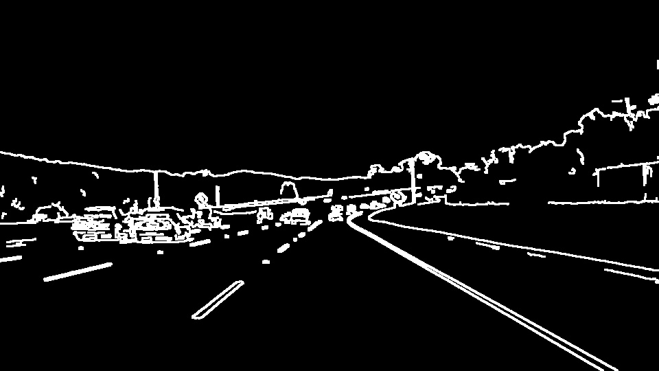
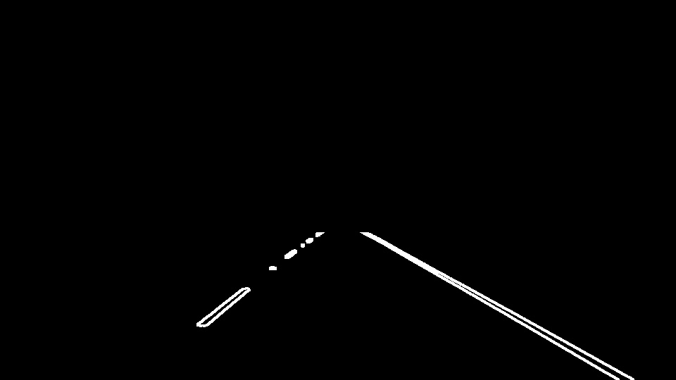
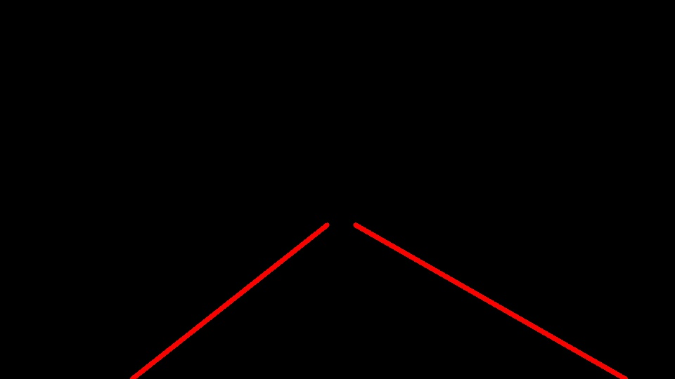
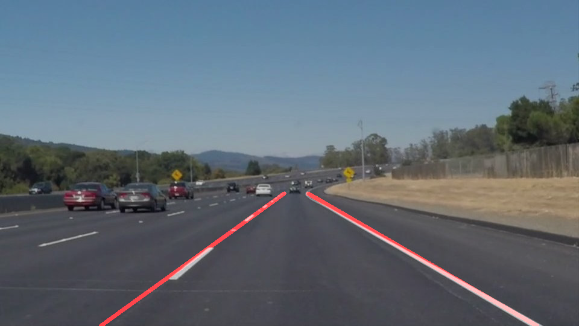

# **Finding Lane Lines on the Road** 

Overview
---

When we drive, we use our eyes to decide where to go.  The lines on the road that show us where the lanes are act as our constant reference for where to steer the vehicle.  Naturally, one of the first things we would like to do in developing a self-driving car is to automatically detect lane lines using an algorithm.

In this project we need to detect lane lines in images using Python and OpenCV.  OpenCV means "Open-Source Computer Vision", which is a package that has many useful tools for analyzing images.  

Pipeline
---
My pipeline mainly consist of ten functions which are explained below
* Start with image or frame from video clip

* Convert the image to gray scale

* Apply Gaussian filter to remove noise

* Auto Canny Edge Detection  
   I have come up with the auto canny edge function to get the lower and higher thresholds automatically for the canny edge detector. 

* Apply dilation to edge image

* Apply mask to get the region of interest

* Apply Hough Lines function  
The masked image is sent to 'hough lines' function to get the lane lines in an image. At the beginning of draw line function I am checking if the line is a part of left lane lines or right lane lines by calculating the slope. After collecting the points of both the lane lines using the slope thresholds, I remove the outliers using standard deviation and mean. I have the function called 'equalize_list' which I use just to make sure that I have a equal length lists of x and y co-ordinates of lane lines points. I then apply the linear regression to these set of points to get the best fit line for left and right lanes. I then extrapolate these lines to find the top and bottom x coordinate of my projected lane lines. Everytime I get the new line, I evaluate it for slope threshold before I make a change to the top and bottom x coordinate of projected lane line. Finally, I have the first order filter just to remove the oscillations/noise in the data points.

* Draw line on top of original image

